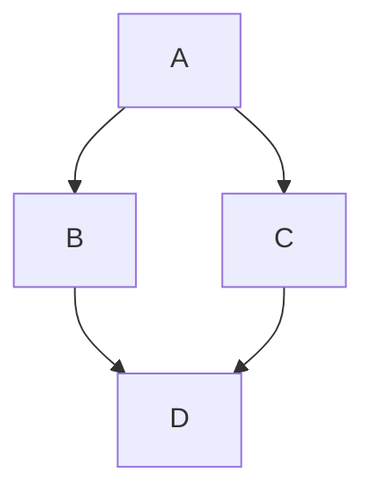

## Multiple Choice
What is one of the primary capabilities of GitHub Copilot when assisting with architectural overviews?
( ) Directly generating visual diagrams for architectures. {{Incorrect. GitHub Copilot does not directly generate visual diagrams; it provides structured textual descriptions or code snippets that can be translated into diagrams using external tools.}}
(x) Providing AI-driven suggestions for textual descriptions of architectures. {{Correct. GitHub Copilot assists by offering AI-driven suggestions for structured textual descriptions, which can be used as a basis for creating architectural diagrams.}}
( ) Automatically deploying the architecture to cloud platforms. {{Incorrect. GitHub Copilot does not handle deployment tasks; its focus is on assisting with coding and architectural documentation.}}

## Multiple Choice
A solution architect wants to create a high-level overview of a serverless application using AWS Lambda and DynamoDB. What is the best way to use GitHub Copilot for this task?
(x) Provide a prompt like 'Generate a high-level overview of a serverless application using AWS Lambda and DynamoDB.' {{Correct. Providing clear and specific prompts helps GitHub Copilot generate relevant suggestions tailored to the desired architecture.}}
( ) Ask Copilot to directly create a visual diagram of the serverless application. {{Incorrect. GitHub Copilot cannot directly create visual diagrams; it generates textual descriptions or code snippets that can be translated into diagrams using external tools.}}
( ) Use Copilot to deploy the serverless application to AWS Lambda and DynamoDB. {{Incorrect. GitHub Copilot is not designed for deployment tasks; its role is to assist in coding and documentation.}}

## Multiple Choice
A platform engineer is using GitHub Copilot to draft an architectural overview for a microservices-based e-commerce platform. After receiving the initial output, what should they do next?
( ) Translate the textual output into a visual diagram using tools like draw.io or Lucidchart. {{Incorrect. While translating the output into a diagram is important, refining the suggestions first ensures accuracy and alignment with project requirements.}}
(x) Review and refine the suggestions to align with the project's requirements. {{Correct. Refining the suggestions ensures the architectural overview is accurate and meets the project's specific needs before creating visual diagrams.}}
( ) Deploy the architecture based on Copilot's suggestions without further review. {{Incorrect. It's crucial to review and refine Copilot's suggestions before proceeding with any implementation or deployment.}}

## Multiple Choice
What is a recommended practice for including sensitive information in markdown-based documentation?
(x) Use placeholders or environment variables instead of actual sensitive data. {{Correct. Using placeholders or environment variables ensures that sensitive information like API keys or passwords is not exposed in the documentation.}}
( ) Include sensitive information directly in the markdown file for easy access. {{Incorrect. Including sensitive information directly in markdown files can lead to security vulnerabilities if the repository is accessed by unauthorized users.}}
( ) Store sensitive information in comments within the markdown file. {{Incorrect. Comments in markdown files are still visible and can expose sensitive information, making this an insecure practice.}}

## Multiple Choice
A developer is documenting an API integration process. What should they do to ensure secrets like API keys are managed securely?
(x) Store the API keys in a secret management tool and provide instructions for accessing them. {{Correct. Using a secret management tool ensures that sensitive information is stored securely, and providing instructions helps developers set up their environment without exposing secrets.}}
( ) Hardcode the API keys in the documentation for convenience. {{Incorrect. Hardcoding API keys in documentation exposes them to unauthorized access and is a poor security practice.}}
( ) Embed the API keys in a private markdown file within the repository. {{Incorrect. Even private markdown files can be accessed by users with repository access, making this approach insecure.}}

## Multiple Choice
A DevOps engineer wants to ensure that only authorized team members can edit markdown-based documentation in a repository. What is the best approach?
(x) Implement role-based access control (RBAC) to restrict who can view or edit the documentation. {{Correct. RBAC allows you to define roles and permissions, ensuring that only authorized team members can edit or view the documentation.}}
( ) Disable editing for all users to prevent unauthorized changes. {{Incorrect. Disabling editing for all users would prevent necessary updates and maintenance of the documentation.}}
( ) Allow unrestricted access but monitor changes regularly. {{Incorrect. Unrestricted access increases the risk of unauthorized changes, even if changes are monitored.}}

## Multiple Choice
What is the primary purpose of secret scanning in GitHub Advanced Security?
(x) To detect sensitive information like API keys or tokens accidentally committed to a repository. {{Correct. Secret scanning identifies patterns of sensitive information, such as API keys or tokens, to prevent potential security breaches.}}
( ) To visualize all dependencies in a project and identify outdated libraries. {{Incorrect. Visualizing dependencies is a feature of the dependency graph, not secret scanning.}}
( ) To automatically update dependencies with known vulnerabilities. {{Incorrect. Updating dependencies is managed by Dependabot alerts, not secret scanning.}}

## Multiple Choice
An AI Engineer is reviewing a pull request that introduces new dependencies. What should they do to ensure the dependencies are secure?
(x) Use the dependency review feature to assess vulnerabilities in the new dependencies. {{Correct. Dependency review provides insights into new dependencies introduced in pull requests, including any known vulnerabilities.}}
( ) Enable push protection to block commits containing secrets. {{Incorrect. Push protection prevents secrets from being committed but does not address dependency vulnerabilities.}}
( ) Define custom patterns to detect proprietary secrets in the codebase. {{Incorrect. Custom patterns are part of secret scanning and are unrelated to dependency review.}}

## Multiple Choice
A DevOps Engineer wants to prevent developers from pushing commits containing secrets to a private repository. What steps should they take?
(x) Enable secret scanning and configure push protection in the repository settings. {{Correct. Secret scanning with push protection prevents commits containing secrets from being pushed to the repository.}}
( ) Enable the dependency graph and monitor pull requests for changes. {{Incorrect. The dependency graph visualizes project dependencies but does not prevent secrets from being committed.}}
( ) Use Dependabot alerts to notify developers of vulnerabilities in dependencies. {{Incorrect. Dependabot alerts focus on dependency vulnerabilities, not secret prevention.}}

## Multiple Choice
What is the primary purpose of using GitHub Copilot with Markdown-supported diagramming tools like Mermaid?
( ) To generate code snippets for complex algorithms. {{Incorrect. While GitHub Copilot can assist with code generation, its integration with Mermaid is specifically for creating diagrams, not generating algorithmic code.}}
(x) To create visual representations of workflows and code structures. {{Correct. GitHub Copilot can assist in creating diagrams with tools like Mermaid, which helps visualize workflows and code structures for better collaboration and understanding.}}
( ) To debug syntax errors in Markdown files. {{Incorrect. Debugging syntax errors is not the primary purpose of using GitHub Copilot with Mermaid. The focus is on creating diagrams.}}

## Multiple Choice
A team wants to document a workflow using a flowchart in their repository. Which steps should they follow to create a Mermaid diagram in a Markdown file?
(x) Open a Markdown file, use a fenced code block with the `mermaid` identifier, and write the diagram syntax. {{Correct. These are the correct steps to create a Mermaid diagram: open a Markdown file, use a fenced code block with the `mermaid` language identifier, and define the diagram syntax within the block.}}
( ) Install a separate diagramming tool, export the diagram as an image, and embed it in the Markdown file. {{Incorrect. This approach is unnecessary when using Mermaid, as it allows you to create diagrams directly within Markdown files without external tools.}}
( ) Write the diagram syntax directly in the Markdown file without using a fenced code block. {{Incorrect. Mermaid diagrams require a fenced code block with the `mermaid` language identifier to render correctly in Markdown files.}}

## Multiple Choice
A DevOps engineer creates the following Mermaid diagram in a Markdown file but encounters a syntax error during rendering. What could be the issue?

(x) The version of Mermaid used by GitHub does not support the syntax. {{Correct. If the syntax is correct but a syntax error occurs, it may be due to an unsupported version of Mermaid on GitHub. Checking the version compatibility is recommended.}}
( ) The diagram syntax is missing a semicolon at the end of each line. {{Incorrect. The provided syntax already includes semicolons at the end of each line, so this is not the issue.}}
( ) The `mermaid` language identifier is incorrect and should be replaced with `diagram`. {{Incorrect. The correct language identifier for Mermaid diagrams is `mermaid`, not `diagram`.}}

## Multiple Choice
What is the primary purpose of GitHub's secret scanning feature?
(x) To detect exposed secrets like API keys or credentials in code repositories. {{Correct. Secret scanning identifies sensitive information, such as API keys or credentials, that may have been accidentally committed to a repository.}}
( ) To enforce branch protection rules for critical branches. {{Incorrect. Branch protection rules are used to safeguard critical branches, not to detect secrets in code repositories.}}
( ) To automate dependency updates and monitor vulnerabilities. {{Incorrect. Automating dependency updates and monitoring vulnerabilities is the role of tools like Dependabot, not secret scanning.}}

## Multiple Choice
A development team wants to prevent secrets from being pushed to their repository. Which GitHub feature should they enable?
(x) Push protection {{Correct. Push protection scans code during the push process and blocks commits containing secrets, preventing them from entering the repository.}}
( ) Dependency review {{Incorrect. Dependency review visualizes changes to dependencies in pull requests but does not prevent secrets from being pushed.}}
( ) Require pull request reviews {{Incorrect. Requiring pull request reviews ensures code quality but does not specifically address secret detection during pushes.}}

## Multiple Choice
A company wants to ensure that only authorized personnel can push directly to critical branches. What GitHub feature should they use?
(x) Restrict branch access {{Correct. Restricting branch access limits who can push directly to protected branches, ensuring only authorized personnel can make changes.}}
( ) Enforce status checks {{Incorrect. Enforcing status checks ensures required checks pass before merging but does not restrict who can push to branches.}}
( ) Enable secret scanning {{Incorrect. Secret scanning detects exposed secrets in code but does not control access to branches.}}

## Multiple Choice
A DevOps engineer is reviewing a pull request and notices changes to dependencies. Which GitHub tool can help them assess the impact of these changes?
(x) Dependency review {{Correct. Dependency review allows engineers to visualize changes to dependencies in pull requests, helping them assess potential impacts before merging.}}
( ) Dependabot alerts {{Incorrect. Dependabot alerts notify users about vulnerable dependencies but do not provide a visualization of dependency changes in pull requests.}}
( ) Export SBOM {{Incorrect. Exporting an SBOM tracks dependencies but does not provide immediate insights into changes within a pull request.}}

## Multiple Choice
Which principle of Zero Trust security involves restricting access to sensitive resources based on roles and responsibilities?
(x) Least privilege access {{Correct. Least privilege access ensures that users only have access to the resources necessary for their roles, reducing the risk of unauthorized access.}}
( ) Assume breach {{Incorrect. Assume breach focuses on continuously monitoring and validating user actions, not restricting access based on roles.}}
( ) Secure precommit to deployment {{Incorrect. Securing precommit to deployment involves integrating security checks throughout the development pipeline, not managing access based on roles.}}

## Multiple Choice
A platform engineer wants to minimize risks in their development environment by auditing installed tools. What additional practice should they adopt?
(x) Use trusted IDE extensions from reputable sources. {{Correct. Using trusted IDE extensions ensures that only verified tools are installed, reducing the risk of introducing vulnerabilities.}}
( ) Enable push protection for all repositories. {{Incorrect. Push protection prevents secrets from being committed but does not address risks associated with installed tools.}}
( ) Export a Software Bill of Materials (SBOM). {{Incorrect. Exporting an SBOM helps track dependencies but does not directly address risks in the development environment.}}